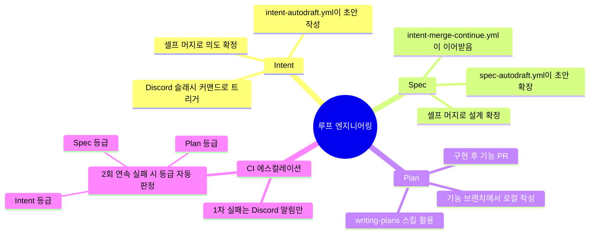

# Contributing Guide

Warding 저장소에 오신 것을 환영합니다. 이 문서는 이 프로젝트에서 작업하실 때 지켜야 할
협업 규칙과, Intent 기반 개발 워크플로우("루프 엔지니어링"), 릴리즈 절차를 안내합니다.

## 목차

- [시작하기 전에](#시작하기-전에)
- [협업 규칙](#협업-규칙)
- [문서 찾기: INDEX.md](#문서-찾기-indexmd)
- [Intent 기반 개발 (intent/)](#intent-기반-개발-intent)
- [Wiki 갱신 (wiki/)](#wiki-갱신-wiki)
- [API 스펙 갱신](#api-스펙-갱신)
- [릴리즈](#릴리즈)
- [Pull Request 체크리스트](#pull-request-체크리스트)

## 시작하기 전에

작업을 시작하기 전에 다음을 확인해 주세요.

- 아키텍처, 폴더 배치 규칙, 색상 토큰, UI 스케일 패턴 등 코드 컨벤션은 `CLAUDE.md`에
  정리되어 있습니다. 먼저 읽어 주세요.
- 무엇을 찾아야 할지 모르시겠다면 아래 "문서 찾기" 섹션을 참고해 주세요.
- 이미 진행 중인 작업과 중복되지 않는지, 열려 있는 PR과 `intent/` 폴더를 먼저
  확인해 주세요.

## 협업 규칙

1. main 브랜치에는 직접 push할 수 없습니다. 모든 변경 사항은 PR을 통해 머지합니다
   (ruleset으로 강제됩니다).
2. PR 제목은 `feat:` 또는 `fix:` 접두사로 시작해 주세요. PR 제목이 그대로 릴리즈
   노트가 됩니다.
3. `pubspec.yaml`의 version은 기능 PR에서 올리지 않습니다. 릴리즈 직전 버전 bump
   PR에서만 올립니다.

아키텍처, 폴더 배치 규칙, 색상 토큰, UI 스케일 패턴 등 코드 컨벤션은 `CLAUDE.md`를
참고해 주세요.

## 문서 찾기: INDEX.md

이 저장소에는 목적이 서로 다른 문서 시스템이 여러 개 있습니다 (개발 규칙, 기능 설계
이력, 아키텍처 참조). 무엇을 찾아야 할지 모르실 때는 매번 각 폴더를 뒤지지 마시고
[INDEX.md](./INDEX.md)부터 열어 주세요. 이 문서는 전체 문서 지도이며, 각 시스템이 무엇을
담당하는지 한 줄로 요약되어 있습니다.

## Intent 기반 개발 (intent/)

기능 하나를 만들기 전에 의도와 설계를 문서로 먼저 남기는 워크플로우입니다. 코드를
작성하기 전에 "왜 만드는지"를 명시적으로 적어 두면, 나중에 리뷰나 후속 작업에서 그
결정을 다시 추론할 필요가 없습니다. 이 저장소에서는 이 흐름을 편의상 "루프
엔지니어링"이라고 부릅니다.

### 진입점 결정하기

모든 작업에 강제되는 절차는 아니며, 문제 성격에 따라 시작 지점이 달라집니다.

| 상황 | 시작 지점 |
|---|---|
| 무엇을 만들어야 하는지 자체가 불명확한 경우 | `intent/<slug>/intent.md`부터 시작합니다 |
| 문제는 명확하지만 설계 결정이 필요한 경우 | `spec.md`부터 시작합니다 (Intent 생략) |
| 문제와 설계가 모두 명확한 버그·작업인 경우 | `plan.md`부터 시작합니다 (Intent/Spec 생략) |
| 오탈자 등 자명한 한 줄 수정인 경우 | 문서 없이 바로 수정합니다 |

- 슬러그 폴더 하나(`intent/<slug>/`)가 기능 하나에 대응합니다. `intent.md`(선택) →
  `spec.md`(선택) → `plan.md`(구현 직전, 로컬 작성) 순서로 쌓입니다.
- Intent/Spec은 각각 `intent/<slug>` / `spec/<slug>` 브랜치의 PR로 제출되며, 머지가
  곧 승인입니다. 셀프 머지도 가능합니다. PR로 남기는 이유는 승인 절차 자체보다
  "의도가 확정된 시점"을 이력에 남기기 위해서입니다.
- 필수 섹션 헤더는 CI(`ci-doc-lint.yml`)가 검증합니다.
- 전체 설계는 이 워크플로우 자체를 셀프 다잉푸딩한 사례인
  [intent/loop-engineering-workflow/spec.md](./intent/loop-engineering-workflow/spec.md)에서
  가장 자세히 확인하실 수 있습니다.

### 한눈에 보는 루프 엔지니어링



### Discord → Intent PR → Spec PR 상세 흐름

Intent/Spec 초안은 직접 작성하지 않고, Discord에서 트리거해 자동으로 생성할 수
있습니다.

1. Discord에서 `/intent` 슬래시 커맨드를 실행하면 모달 창이 뜨고, slug와 설명을
   입력합니다.
2. `tools/discord-bridge/api/discord/interactions.js` (Vercel Function)가 Ed25519
   서명을 검증한 뒤, 모달 제출을 받으면 즉시 "접수됨" 응답을 보내고 GitHub
   `repository_dispatch`를 호출합니다 (`event_type: "intent-request"`).
3. `.github/workflows/intent-autodraft.yml`이 이를 받아 `intent/<slug>` 브랜치를
   생성하고 (동명 브랜치가 이미 열려 있으면 중복을 방지합니다), Anthropic API로
   intent.md의 5개 섹션(Problem / Proposed outcome / Affected users and systems /
   Constraints / Open questions) 초안을 작성한 뒤, 생성한 요약 본문으로 PR을 엽니다.
4. 개발자가 초안을 검토·수정한 뒤 셀프 머지합니다. 이 머지가 곧 "의도 확정"의
   승인입니다.
5. `.github/workflows/intent-merge-continue.yml`이 `intent/*` 브랜치의 PR이 머지되는
   순간을 감지해 `spec-request`를 dispatch합니다.
6. `.github/workflows/spec-autodraft.yml`이 `spec/<slug>` 브랜치를 생성하고, 머지된
   intent.md를 입력으로 spec.md 초안(Summary / Requirements / Design·Approach /
   Decisions / Out of scope / Open questions)을 확장 작성한 뒤 PR을 엽니다.
7. 개발자가 spec을 검토·수정한 뒤 셀프 머지합니다.
8. 이후 기능 브랜치에서 `plan.md`를 작성하고(로컬, writing-plans 스킬 활용) 구현한
   뒤, 기본 템플릿으로 기능 PR을 엽니다.

초안이 마음에 들지 않으시면 해당 `intent/<slug>` 또는 `spec/<slug>` 브랜치를
체크아웃해 직접 수정한 뒤 다시 푸시하시면 됩니다. 평범한 git 브랜치이므로 별도의
수정 절차가 필요하지 않습니다. 이 파이프라인은 **문제가 불명확할 때만** 필요합니다.
문제와 설계가 이미 명확하다면 Intent/Spec을 생략하고 바로 `plan.md`나 코드 수정으로
시작하셔도 됩니다 (위 진입점 표를 참고해 주세요).

### CI 반복 실패 → 자동 에스컬레이션

`ci-flutter-test.yml`은 모든 PR(문서만 변경된 Intent/Spec PR 포함)에서
`flutter analyze && flutter test`를 실행합니다. 실패가 반복되면 다음 순서로 자동
대응합니다.

1. **1차 실패**: Discord로 "🔴 CI 실패" 알림만 전송합니다.
2. **같은 브랜치에서 2회 연속 실패**: 직전 커밋의 CI 결과를 GitHub API로 조회해
   결정론적으로(LLM 판단이 아닙니다) 감지하고, `escalate` job이 Anthropic API를 한
   번 호출해 실패 로그·diff·커밋 이력을 분석한 뒤 문제 성격에 따라 다음 3등급 중
   하나로 대응합니다.
   - **Plan 등급** (단순 버그로 판단되는 경우): 같은 브랜치에 `plan.md`를 추가
     커밋합니다 (시도한 것 · 실패 원인 · 수정 방향을 담습니다).
   - **Spec 등급** (설계 결정이 잘못되었다고 판단되는 경우): `spec/<slug>-fix`
     브랜치로 새 PR을 엽니다 (`spec-autodraft.yml`을 재사용합니다).
   - **Intent 등급** (문제 전제 자체가 잘못되었다고 판단되는 경우):
     `intent/<slug>-fix` 브랜치로 새 PR을 엽니다 (`intent-autodraft.yml`을
     재사용하며, 실패 로그가 Problem 섹션의 재료가 됩니다).
3. Discord로 "⚠️ 2회 연속 실패: Plan/Spec/Intent 자동 생성됨" 알림을 전송합니다.

이 자동화는 **코드를 직접 수정하지 않습니다**. "다음에 무엇을 해야 하는지 적힌
문서"까지만 만들고 멈춥니다. 실제 수정은 사람(또는 에이전트)이 그 문서를 보고 기존
개발 흐름대로 진행합니다.

### 필요한 인프라

- **Vercel**: `tools/discord-bridge/`를 이 저장소의 서브디렉토리로 배포합니다
  (Flutter 툴체인과 완전히 분리되어 있어 `flutter analyze` 등에 영향을 주지
  않습니다). 환경변수로 `DISCORD_PUBLIC_KEY`, `DISPATCH_TOKEN`, `GITHUB_REPO`가
  필요합니다.
- **GitHub Actions 시크릿**: `ANTHROPIC_API_KEY`(초안 생성용)와
  `DISPATCH_TOKEN`(`repository_dispatch` 호출 및 PR 생성용 fine-grained PAT)이
  필요합니다. PAT의 Repository access는 대상 저장소로만 제한하고, Repository
  permissions에 `Contents: Read and write`와 `Pull requests: Read and write`를
  부여해 주세요. 기본 `GITHUB_TOKEN`으로 연 PR·푸시는 새 CI 실행을 트리거하지
  못하므로(GitHub의 재귀 방지 동작입니다), 자동 초안 PR과 워크플로우 간 트리거에는
  반드시 이 PAT을 사용합니다.
- **Discord 슬래시 커맨드 등록**: `scripts/register-discord-commands.mjs`를 1회
  실행합니다 (커맨드 스키마가 바뀌면 재실행해 주세요).

## Wiki 갱신 (wiki/)

`wiki/`는 "지금 코드가 실제로 어떻게 동작하는지"를 담은 살아있는 참조 문서입니다.
`intent/`가 "결정 당시의 왜"를 남긴다면, `wiki/`는 그 결정이 반영된 이후의 최신
스냅샷입니다.

이 갱신은 자동화된 스크립트가 아니라 **작업하면서 매번 스스로 판단해 적용해야 하는
규칙**입니다. 커밋이나 PR 시점에 강제로 검증되지 않으므로, 아래 조건에 해당하는
변경을 하실 때 놓치지 않도록 주의해 주세요.

- 기능을 완료·변경하면 → `wiki/features/{기능}.md`를 갱신합니다.
- 아키텍처·파일 규칙·디자인 토큰이 바뀌면 → `wiki/architecture/` 또는
  `wiki/design/`을 갱신합니다.
- 새 기능 영역이 생기면 → `wiki/features/`에 문서를 추가하고 `features/index.md`와
  루트 `index.md`에 링크합니다.
- 의미 있는 변경 이후에는 `wiki/log.md` 맨 위에 날짜 항목을 추가합니다.

정확한 규칙 전문과 프론트매터 스키마는 `CLAUDE.md`의 "지식 번들 (wiki)" 섹션을
참고해 주세요. Spec을 승인(머지)할 때도 그 설계가 위 조건에 해당하는지 다시 한번
확인해 주세요. `.github/PULL_REQUEST_TEMPLATE/spec.md` 체크리스트를 참고하시면
됩니다.

## API 스펙 갱신

백엔드 Swagger 스펙 요약은 `docs/api-reference.md`에, 원본 OpenAPI JSON은
`docs/openapi_spec.json`에 있습니다. 최신 스펙으로 갱신하시려면 다음 명령을
실행해 주세요.

```bash
NAR_SWAGGER_USER=아이디 NAR_SWAGGER_PASS=비밀번호 python3 scripts/fetch_api_spec.py
```

이 명령을 실행하면 `docs/openapi_spec.json`이 갱신됩니다. `docs/api-reference.md`
요약본(엔드포인트 태그별 목록)도 함께 갱신하시려면, 새 스펙을 기준으로 해당 파일
내용을 다시 생성해 주셔야 합니다.

Swagger 계정 정보는 팀 채널이나 노션 등에서 확인해 주세요.

## 릴리즈

버전의 진실은 `pubspec.yaml`의 `version: X.Y.Z+N` 하나입니다. `X.Y.Z`는 스토어에
표시되는 버전이고, `+N`은 versionCode이므로 스토어에 제출할 때마다 반드시 1씩
증가시켜 주세요.

스토어 제출은 **반드시 `shorebird release`로 빌드해 주세요** (`flutter build ipa` /
`flutter build appbundle`은 금지입니다. 일반 빌드는 Shorebird 코드 푸시를 받을 수
없기 때문입니다). 빌드 직전에는 `release/<버전>` 형식의 annotated 태그를 찍어 어느
커밋이 릴리즈되었는지 남겨 주세요. 전체 절차와 태그 규칙, 릴리즈 이후 핫픽스
(Shorebird patch) 정책은 `CLAUDE.md`의 "릴리즈 / 배포 (Shorebird)" 섹션을
참고해 주세요.

## Pull Request 체크리스트

PR을 올리시기 전에 다음을 확인해 주세요.

- [ ] 코드 컨벤션(`CLAUDE.md`)을 따랐는지 확인했습니다. 색상은 하드코딩하지 않고
      `AppColors`를 참조했으며, MVVM 계층도 분리했는지 확인했습니다.
- [ ] `flutter analyze`와 `flutter test`를 로컬에서 실행해 통과를 확인했습니다.
- [ ] UI가 바뀐 화면은 시뮬레이터에서 직접 확인했습니다
      (`.claude/skills/run-warding/` 참고).
- [ ] 기능을 완료·변경했다면 `wiki/`를 갱신했는지 확인했습니다.
- [ ] PR 제목이 `feat:` 또는 `fix:`로 시작합니다.
- [ ] 관련된 `intent/<slug>/` 문서(있다면)를 링크했습니다.
