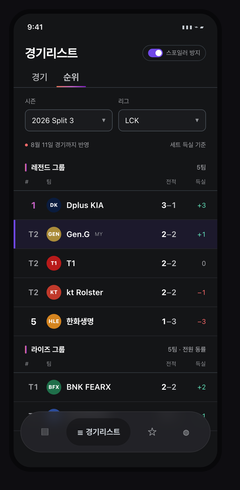
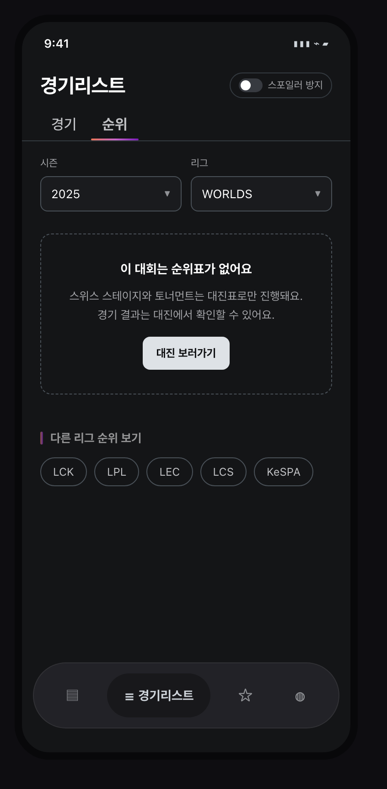
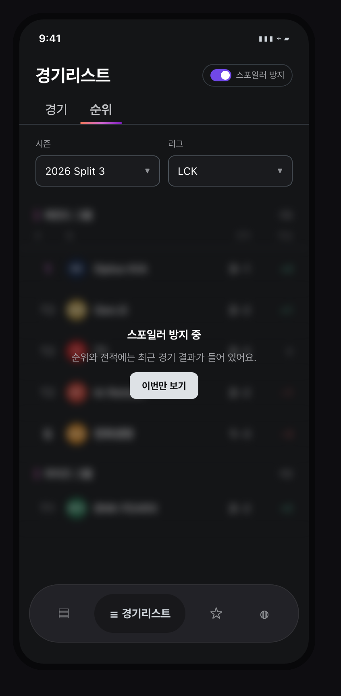
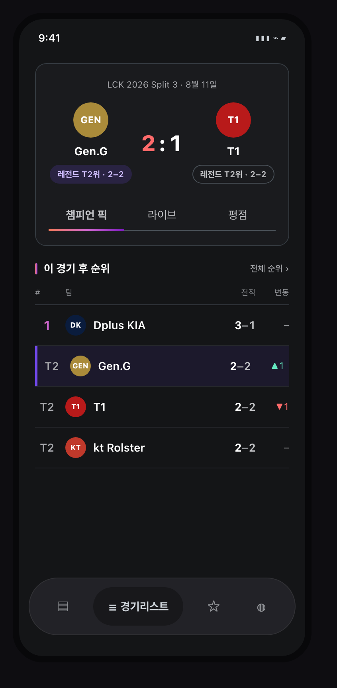

# 리그 순위표 배치 검토

lolesports API에서 리그 순위를 가져올 수 있게 되어, 앱 어디에 순위표를 놓을지 정리한 문서입니다.
결론은 하단 네비에 탭을 추가하지 않고 경기리스트 화면 안에 세그먼트로 넣는 것입니다.
아래에 배치 근거, 화면별 목업, 순위표에만 있는 함정 세 가지, 구현 시 건드릴 파일을 담았습니다.

| | |
|---|---|
| 배치 | 경기리스트 탭 안 `경기 / 순위` 세그먼트 |
| 새 화면 | 없음. 기존 화면 본문만 분기 |
| 백엔드 작업 | 순위 프록시 API 신규 (미착수) |
| 앱 수정 파일 | 1개 수정 + 4개 신규 |
| 결정 필요 | 스포일러 방지 ON일 때 순위를 가릴지 |

## 배경

`getStandingsV3`로 리그 순위를 가져올 수 있습니다. 팀별 순위(`ordinal`)와 매치 전적(`wins`/`losses`)이
내려옵니다. 다만 순위가 채워지는 대회는 풀리그와 조별리그뿐입니다. 스위스와 플레이오프는 순위가
빈 배열로 오고 대진표만 옵니다. 2026년 8월 기준으로 LCK, LPL, LEC, LCS, CBLOL, KeSPA Cup은 순위가
나오고 WORLDS, MSI, EWC, LCP는 나오지 않습니다.

앱에는 지금 순위를 보여주는 화면이 없습니다. 어디에 넣을지가 이 문서의 주제입니다.

## 배치 제약

세 가지 제약이 후보를 좁혔습니다.

첫째, 하단 네비에 자리가 없습니다. `lib/components/app_bottom_nav.dart`의 pill은 폭 335로 고정입니다.
활성 탭 최소 113 + 비활성 44×3 + gap 16×3 = 293이라 5번째 탭을 넣으면 337이 되어 넘칩니다.
탭을 추가하려면 네비를 다시 설계해야 합니다.

둘째, 순위표에는 리그와 스플릿이 반드시 필요합니다. 이 두 값을 이미 쥐고 있는 화면은 경기리스트
하나뿐입니다. 시즌·리그 `SearchSelectBox`가 이미 헤더에 있어서 순위를 여기 붙이면 셀렉터를 새로
만들지 않아도 됩니다.

셋째, 경기일정(캘린더)은 '월' 축으로 움직이고 순위는 '스플릿' 축으로 움직입니다. 축이 다른 두 데이터를
한 헤더 아래 묶으면 필터가 두 벌로 갈라지고, 월을 이동했을 때 순위가 어느 시점 기준인지 모호해집니다.

## 방안: 경기리스트 안 세그먼트

경기리스트 화면 상단에 `NarTabBar(compact)` 세그먼트를 얹고 `경기`와 `순위`를 전환합니다.
헤더, 시즌·리그 셀렉터, 하단 네비, 스크롤 최상단 버튼은 그대로 두고 본문만 바꿉니다.



화면에서 눈여겨볼 곳은 세 군데입니다.

동률은 `T2` 형태로 표기합니다. API는 동률 팀을 하나의 `ordinal` 아래 `teams[]` 배열로 묶어서
보냅니다. 2026-08-11 기준 LCK 라이즈 그룹은 5팀 전원이 2승 2패 공동 1위입니다. 여기에 `1 2 3 4 5`를
찍으면 없는 서열을 만들어내는 화면이 됩니다.

온보딩에서 고른 선호 팀 행은 좌측 3px 보더와 옅은 보라 배경으로 강조합니다. 순위표에서 유저가 가장
먼저 찾는 것은 자기 팀 줄입니다. 값은 `ScheduleHeader.preferredTeam`으로 이미 들고 있습니다.

세트 득실 열은 서버가 계산해서 내려줘야 합니다. API의 `record`는 매치 단위 승/무/패까지만 주고
세트 득실은 주지 않습니다. `league_match` 테이블에 세트 스코어가 있으니 백엔드에서 얹으면 됩니다.
급하면 이 열을 빼고 시작해도 화면은 성립합니다.

## 빈 화면 두 가지

순위가 안 나오는 경우가 두 가지 있고, 둘 다 처리하지 않으면 버그로 신고받습니다.

첫째는 순위표가 원래 없는 대회입니다. WORLDS, MSI, EWC, LCP(2026 Split 3부터)가 여기 해당합니다.
"불러오기 실패"가 아니라 대진표로만 진행되는 대회라고 알려주고, 순위가 있는 다른 리그로 이동할
길을 둡니다.



둘째는 스포일러 방지입니다. 경기리스트에는 이미 `NarSpoilerToggle`이 있는데, 순위표는 그 자체가
스포일러입니다. 전적만 봐도 어제 경기 결과가 드러납니다. 토글이 켜져 있으면 순위 영역을 블러로
가리고 "이번만 보기"로 한 번 열 수 있게 합니다. 순위를 보러 들어온 사람에게 토글을 끄러 나가라고
하면 그게 더 나쁜 경험입니다.



리그를 '전체'로 둔 경우도 순위를 낼 수 없습니다. 선호 팀이 있으면 그 팀의 리그를 기본값으로 넣어서
빈 화면 자체를 만들지 않습니다.

## 매치 상세의 순위 뱃지

순위표를 따로 찾아보는 사람보다 경기를 보다가 순위가 궁금해지는 사람이 많습니다. 매치 상세의 팀 이름
아래에 `레전드 T2위 · 2-2` 한 줄을 넣고, 더 보고 싶은 사람만 전체 순위로 보냅니다.



매치의 리그와 스플릿을 이미 알고 있어서 순위 응답 하나를 캐시에서 꺼내 두 팀만 뽑으면 됩니다.
추가 API 호출은 없습니다.

여기서는 스포일러가 더 예민합니다. 순위 변동 화살표(▲1, ▼1)는 승패를 그대로 알려줍니다.
경기 결과를 이미 펼친 상태에서만 변동을 보여줍니다.

## 검토했다가 뺀 자리

| 후보 | 판정 | 이유 |
|---|---|---|
| 하단 네비 5번째 탭 | 탈락 | pill 폭 335를 337로 초과. 순위는 상시 탭을 줄 만큼 열람 빈도가 높지 않음 |
| 경기일정 헤더 | 탈락 | 캘린더는 월 축, 순위는 스플릿 축. 필터가 두 벌로 갈라짐 |
| 마이구독 탭 | 탈락 | 구독은 알림 설정 화면. 조회형 콘텐츠를 섞으면 탭 역할이 흐려짐 |
| 독립 순위 화면 | 보류 | 세그먼트가 커지면 그때 분리. 지금 나누면 셀렉터를 한 벌 더 만들어야 함 |
| 홈 화면 카드 | 보류 | `HomeScreen`이 placeholder이고 하단 네비에도 없음 |

## 구현 시 건드릴 파일

| 파일 | 작업 |
|---|---|
| `screens/match_list/match_list_screen.dart` | 세그먼트 추가, 본문 분기 |
| `screens/match_list/component/standings_section.dart` | 신규. 조 헤더 + 순위 행 + 빈 상태 3종 |
| `viewmodel/match_list/standings_viewmodel.dart` | 신규. 리그·스플릿 변경 구독, 로딩·미지원·동률 상태 |
| `repository/standings/standings_repository.dart` | 신규. 백엔드 순위 API 호출 |
| `model/standing.dart` | 신규. `ordinal` / `teams[]` / `record` |

모델을 평탄화하지 마세요. `rankings[].teams[]`를 팀 한 줄짜리 리스트로 펴면 동률 정보가 사라집니다.
중첩 구조를 그대로 들고 가고, 표시할 때만 `T` 접두를 붙입니다.

## 결정할 것

스포일러 방지가 켜져 있을 때 순위 세그먼트를 블러로 가릴지, 아니면 순위에서는 토글을 무시할지
정해야 합니다. 목업은 블러 기준으로 그렸습니다.

## 참고

목업 색상은 `lib/styles/app_colors.dart` 토큰을 그대로 썼습니다. Pretendard 대신 시스템 폰트로
렌더링했고 팀 로고는 원형 플레이스홀더입니다. 실제 화면에서는 `CachedNetworkImage`로 들어갑니다.
순위 값은 2026-08-11 LCK Split 3 실제 데이터입니다.

목업 원본은 `images/standings/src/`에 있습니다. 아래 명령으로 다시 렌더링할 수 있습니다.

```bash
cd docs/images/standings/src
CH="/Applications/Google Chrome.app/Contents/MacOS/Google Chrome"
for i in 1 2 3 4; do
  "$CH" --headless --disable-gpu --hide-scrollbars --force-device-scale-factor=2 \
    --window-size=423,860 --screenshot=shot$i.png --virtual-time-budget=1500 \
    "file://$PWD/$i.html"
done
```
